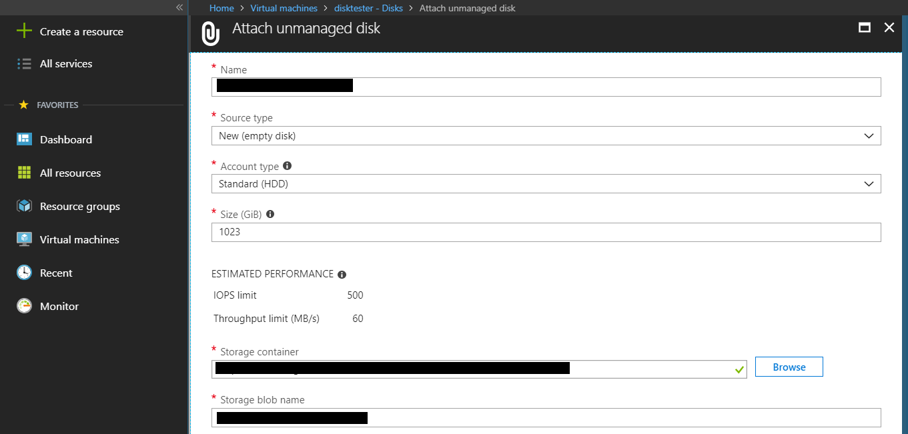
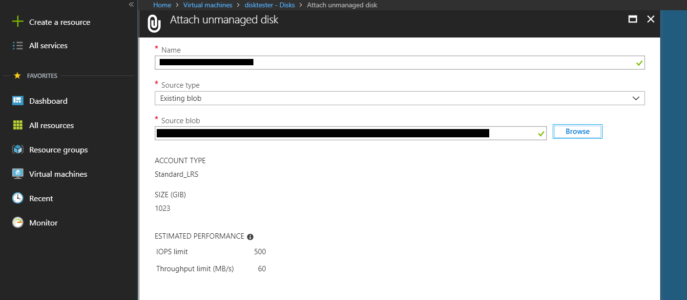

# Adding disks on Azure Stack

## Overview

In Azure Stack there are two types of disks, **Managed** and **Unmanaged** both these disks can be used on VM's as both OS and data disks.

### Managed disks

These disks simplify disk management for Azure IaaS VMs by managing the storage accounts associated with the VM disks. You only have to specify the size of disk you need, and Azure Stack creates and manages the disk for you.

### Unmanaged disks

These disks require that you create a storage account to store the disks. The disks you create are referred to as VM disks and are stored in containers in the storage account.

## Using the portal to add new disks to VM's

1. In the portal choose **Virtual machines**.

2. Select the VM you wish to add disks too.

3. Navigate to **Disks** > **+Add data disk**.

    

4. Edit the options for your new Disk.

    - **Name**: This is what the disk will be called.

    - **Source type**: Leave this as **New(empty disk)** as we are creating a new disk.

    - **Account type**: This is where you choose between SSD and HDD.

    - **Size**: This is where you specify the size of the new disk.

    - **Storage container**: This is where you specify the storage container for the disk. Find the storage account where your VM's OS disk is located and then create a new.

    - **Container**. Select this container as the location for the new disk.

    - **Storage blob name**: This is the blob where the disk will be stored.

    

5. Select Ok and the new disks will be added to the VM.

## Using the portal to add disks to existing VM's

1. Ensure the existing disk you want to add to your VM is on you local machine as a .vhd file. Upload this .vhd to a new Container in your VM's storage account.

2. After the .vhd file is uploaded, you are ready to attach the VHD to a VM. In the menu on the left, select **Virtual machines**.

3. Chose the VM you wish to add the disk to.

4. In **Source type** select **Existing blob**.

5. In **Source blob** select **Browse**.

6. Navigate to the storage account you uploaded the .vhd file to > select the container you uploaded the .vhd file to and click **Select**.

    

7. Finally click **OK** then **Save**.

## Adding a disk to a VM that is already attached to another VM on Azure Stack

Please ensure the disk is has been detached from its original VM.

1. In the menu on the left, select **Virtual machines**.

2. Chose the VM you wish to add the disk to.

3. In **Source type** select **Existing blob**.

4. In **Source blob** select **Browse**.

5. Navigate to the storage container which contains the disk you wish to add to the VM, then navigate to the container where the disk resides.

6. Finally click **Select** > **OK** > **Save**

## Using PowerShell to add disks to a new VM

In one of our other guides we showed you how to provision a VM (which can be found [here](azs-how-create-vm.md)) and the code in this guide will build off that. The Add-AzureRmVMDataDisk cmdlet adds a data disk to a virtual machine. You can add a data disk when you create a virtual machine, or you can add a data disk to an existing virtual machine. Specifying the VhdUri parameter to distribute the disks to different containers.  

The following code will demonstrate how to add multiple disks to that VM on startup.

```powershell
#Sets the disks properties
$DataDiskVhd3 = "DataDisk1"
$DataDisk3 = '{0}vhds/{1}-{2}.vhd' -f $StorageAccount.PrimaryEndpoints.Blob.ToString(), $VMName.ToLower(), $DataDiskVhd3

# Applies the additional disks properties
$VirtualMachine = Add-AzureRmVMDataDisk -VM $VirtualMachine -Name $DataDiskVhd1 -Caching 'ReadOnly' -DiskSizeInGB 10 -Lun 1  -VhdUri $DataDisk1 -CreateOption Empty
```

A full example of this code in use would be:

```powershell
## Initialise environment and variables

# Add environment
Add-AzureRMEnvironment -Name 'AzureStack' -ArmEndpoint 'https://management.frn00006.azure.ukcloud.com'

# Login
Login-AzureRmAccount -EnvironmentName 'AzureStack'

# Input Variables
$RGName = 'myResourceGroup'
$SAName = 'myStorageAccount'
$Location = 'frn00006'
$SubnetName = 'mySubnet'
$SubnetRange = '192.168.1.0/24'
$VNetName = 'myVNetwork'
$VNetRange = '192.168.0.0/16'
$PublicIPName = 'myPublicIP'
$NSGName = 'myNSG'
$NICName = 'myNIC'
$VMName = 'myVM'
$VMSize = 'Standard_A2'
$ComputerName = 'myComputer'
$VMImage = '*/CentOS/Skus/6.10'

# Create a new resource group
Write-Host "Creating resource group"
New-AzureRmResourceGroup -Name $RGName -Location $Location

## Create storage resources

# Create a new storage account
Write-Host "Creating storage account"
$StorageAccount = New-AzureRmStorageAccount -Location $Location -ResourceGroupName $RGName -Type 'Standard_LRS' -Name $SAName

## Create network resources

# Create a subnet configuration
Write-Host "Creating virtual network"
$SubnetConfig = New-AzureRmVirtualNetworkSubnetConfig -Name $SubnetName -AddressPrefix $SubnetRange

# Create a virtual network
$VirtualNetwork = New-AzureRmVirtualNetwork -ResourceGroupName $RGName -Location $Location -Name $VNetName -AddressPrefix $VNetRange -Subnet $SubnetConfig

# Create a public IP address
Write-Host "Creating public IP address"
$PublicIP = New-AzureRmPublicIpAddress -ResourceGroupName $RGName -Location $Location -AllocationMethod 'Dynamic' -Name $PublicIPName

# Create a network security group
Write-Host "Creating network security group"
$NetworkSG = New-AzureRmNetworkSecurityGroup -ResourceGroupName $RGName -Location $Location -Name $NSGName

# Create a virtual network card and associate it with the public IP address and NSG
Write-Host "Creating network interface card"
$NetworkInterface = New-AzureRmNetworkInterface -Name $NICName -ResourceGroupName $RGName -Location $Location -SubnetId $VirtualNetwork.Subnets[0].Id -PublicIpAddressId $PublicIP.Id -NetworkSecurityGroupId $NetworkSG.Id

## Create the virtual machine

# Define a credential object to store the username and password for the virtual machine
$UserName = 'myUser'
$Password = 'Password123!' | ConvertTo-SecureString -Force -AsPlainText
$Credential = New-Object PSCredential($UserName,$Password)

# Create the virtual machine configuration object
$VirtualMachine = New-AzureRmVMConfig -VMName $VMName -VMSize $VMSize

# Set the VM Size and Type
$VirtualMachine = Set-AzureRmVMOperatingSystem -VM $VirtualMachine -Linux -ComputerName $ComputerName -Credential $Credential

# Get the VM Source Image
$Image = Get-AzureRMVMImagePublisher -Location $Location | Get-AzureRmVMImageOffer | Get-AzureRmVMImageSku | Where-Object {$_.Id -like $VMImage}

# Set the VM Source Image
$VirtualMachine =  Set-AzureRmVMSourceImage -VM $VirtualMachine -PublisherName $Image.PublisherName -Offer $Image.Offer -Skus $Image.Skus -Version 'latest'

# Add Network Interface Card
$VirtualMachine = Add-AzureRmVMNetworkInterface -Id $NetworkInterface.Id -VM $VirtualMachine

# Set the OS Disk properties
$OSDiskName = "OsDisk"
$OSDiskUri = '{0}vhds/{1}-{2}.vhd' -f $StorageAccount.PrimaryEndpoints.Blob.ToString(), $VMName.ToLower(), $OSDiskName

# Applies the OS disk properties
$VirtualMachine = Set-AzureRmVMOSDisk -VM $VirtualMachine -Name $OSDiskName -VhdUri $OSDiskUri -CreateOption FromImage

# Set additional disks properties
$DataDiskVhd1 = "DataDisk1"
$DataDisk1 = '{0}vhds/{1}-{2}.vhd' -f $StorageAccount.PrimaryEndpoints.Blob.ToString(), $VMName.ToLower(), $DataDiskVhd1

$DataDiskVhd2 = "DataDisk2"
$DataDisk2 = '{0}vhds/{1}-{2}.vhd' -f $StorageAccount.PrimaryEndpoints.Blob.ToString(), $VMName.ToLower(), $DataDiskVhd2

$DataDiskVhd3 = "DataDisk3"
$DataDisk3 = '{0}vhds/{1}-{2}.vhd' -f $StorageAccount.PrimaryEndpoints.Blob.ToString(), $VMName.ToLower(), $DataDiskVhd3

# Applies the additional disks properties
$VirtualMachine = Add-AzureRmVMDataDisk -VM $VirtualMachine -Name $DataDiskVhd1 -Caching 'ReadOnly' -DiskSizeInGB 10 -Lun 0  -VhdUri $DataDisk1 -CreateOption Empty
$VirtualMachine = Add-AzureRmVMDataDisk -VM $VirtualMachine -Name $DataDiskVhd2 -Caching 'ReadOnly' -DiskSizeInGB 10 -Lun 1 -VhdUri $DataDisk2 -CreateOption Empty
$VirtualMachine = Add-AzureRmVMDataDisk -VM $VirtualMachine -Name $DataDiskVhd3 -Caching 'ReadOnly' -DiskSizeInGB 10 -Lun 2 -VhdUri $DataDisk3 -CreateOption Empty

# Create the virtual machine.
Write-Host "Creating virtual machine"
$NewVM = New-AzureRmVM -ResourceGroupName $RGName -Location $Location -VM $VirtualMachine
$NewVM
Write-Host "Virtual machine created successfully"
```

## Using PowerShell to add disks to an existing VM

The following code will add new disks to VM's that already exists. It retrieves the VM from the resource group, modifies it and then updates it on the stack

```powershell
# Retrieves the VM
$VirtualMachine = Get-AzureRmVM -ResourceGroupName "myResourceGroup" -Name "myVM"

# Set additional disks properties
$DataDiskVhd1 = "DataDisk4"
$DataDisk1 = '{0}vhds/{1}-{2}.vhd' -f $StorageAccount.PrimaryEndpoints.Blob.ToString(), $VMName.ToLower(), $DataDiskVhd1

# Applies the additional disks properties
$VirtualMachine = Add-AzureRmVMDataDisk -VM $VirtualMachine -Name $DataDiskVhd1 -Caching 'ReadOnly' -DiskSizeInGB 10 -Lun 4  -VhdUri $DataDisk1 -CreateOption Empty

# Updates the VM
Update-AzureRmVM -ResourceGroupName "myResourceGroup" -VM $VirtualMachine
```

> [!IMPORTANT]
> Remember each time you add a disk to increase the **LUN** (Logical Unit Number).

## Next Steps

Now you know how to add disks to VM's this guide will be needed in the following guides:

- [How to setup disaster recovery for Azure Stack VMs to Azure](azs-how-setup-recovery-portal.md)

## Feedback

 If you find an issue with this article, click **Improve this Doc** to suggest a change. If you have an idea for how we could improve any of our services, visit [*UKCloud Ideas*](https://ideas.ukcloud.com). Alternatively, you can contact us at <products@ukcloud.com>.
