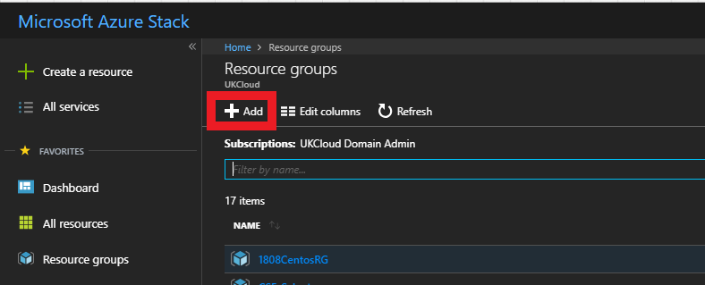
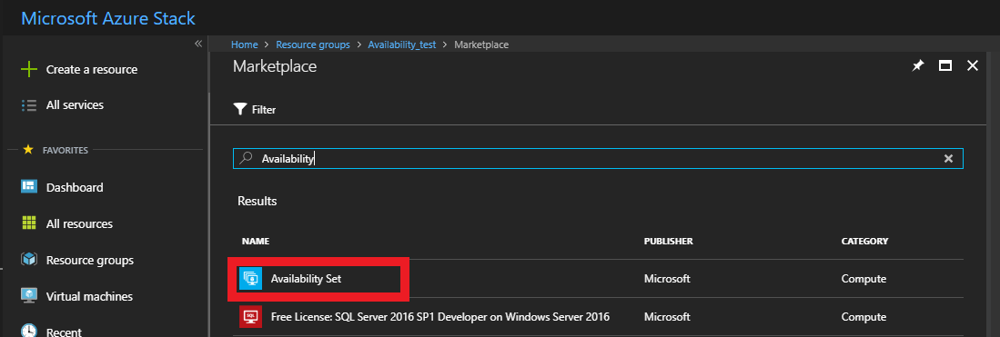
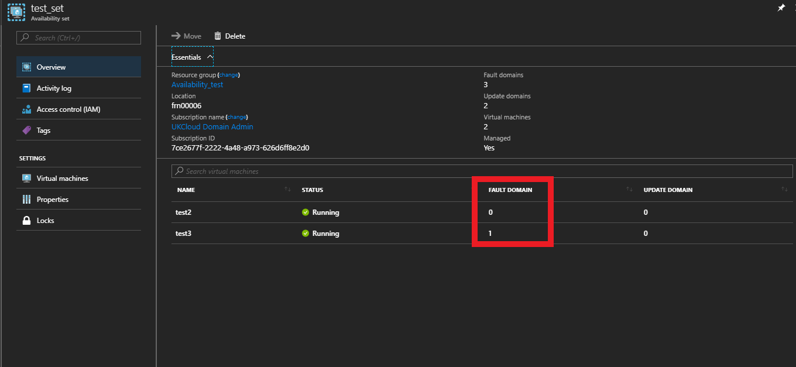

# Overview

In this guide, you learn how to increase the availability and reliability of your Virtual Machine solutions on Azure Stack using a capability called **Availability Sets**. Availability sets ensure that the VMs you deploy on Azure Stack are distributed across multiple isolated hardware nodes in a cluster. Doing this ensures that if a hardware or software failure within Azure Stack happens, only a subset of your VMs are impacted and that your overall solution remains available and operational.

## Availability sets

An Availability Set is a logical grouping capability that you can use in Azure to ensure that the VM resources you place within it are isolated from each other when they are deployed within an Azure datacenter. Azure ensures that the VMs you place within an Availability Set run across multiple physical servers, compute racks, storage units, and network switches. If a hardware or Azure software failure occurs, only a subset of your VMs are impacted, and your overall application stays up and continues to be available to your customers. Availability Sets are an essential capability when you want to build reliable cloud solutions.

Let’s consider a typical VM-based solution where you might have four front-end web servers and 2 back-end VMs hosting databases. With Azure Stack, you’d want to define two availability sets before you deploy your VMs: one availability set for the web tier and one availability set for the back tier. When you create a new VM you can then specify the availability set as a parameter to the `az vm` create command, and Azure Stack automatically ensures that the VMs you create within the available set are isolated across multiple physical hardware resources. If the physical hardware that one of your Web Server or back-end VMs is running on has a problem, you know that the other instances of your Web Server and back-end VMs remain running because they are on different hardware.

## Creating an availability set via the portal

1. The first step when initially creating an availability set is to create the resource group the availability set

    

2. t

    

3. t

    

4. t

    

5. t

    

6. t

    

7. t

    

## Creating an availability set via PowerShell

## Feedback

 If you find an issue with this article, click **Improve this Doc** to suggest a change. If you have an idea for how we could improve any of our services, visit [*UKCloud Ideas*](https://ideas.ukcloud.com). Alternatively, you can contact us at <products@ukcloud.com>.
