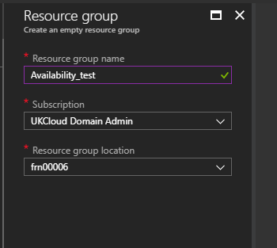
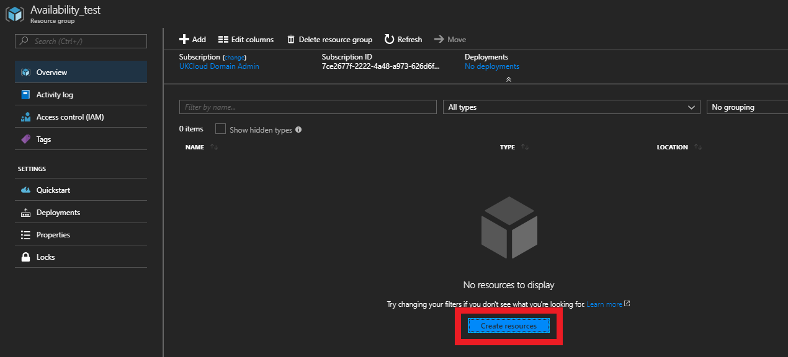
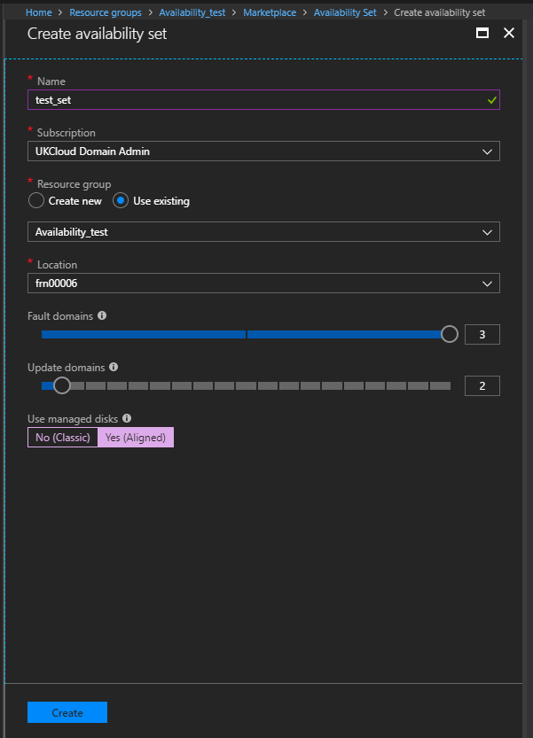
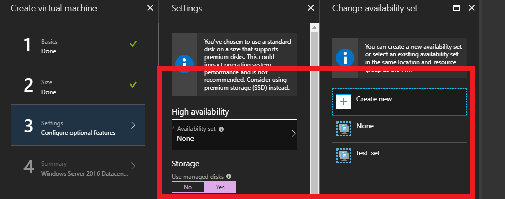

# Overview

In this guide, you learn how to increase the availability and reliability of your Virtual Machine solutions on Azure Stack using a capability called **Availability Sets**. Availability sets ensure that the VMs you deploy on Azure Stack are distributed across multiple isolated hardware nodes in a cluster. Doing this ensures that if a hardware or software failure within Azure Stack happens, only a subset of your VMs are impacted and that your overall solution remains available and operational.

## Availability sets

An Availability Set is a logical grouping capability that you can use in Azure to ensure that the VM resources you place within it are isolated from each other when they are deployed within an Azure datacenter. Azure ensures that the VMs you place within an Availability Set run across multiple physical servers, compute racks, storage units, and network switches. If a hardware or Azure software failure occurs, only a subset of your VMs are impacted, and your overall application stays up and continues to be available to your customers. Availability Sets are an essential capability when you want to build reliable cloud solutions.

Let’s consider a typical VM-based solution where you might have four front-end web servers and 2 back-end VMs hosting databases. With Azure Stack, you’d want to define two availability sets before you deploy your VMs: one availability set for the web tier and one availability set for the back tier. When you create a new VM you can then specify the availability set as a parameter to the `az vm` create command, and Azure Stack automatically ensures that the VMs you create within the available set are isolated across multiple physical hardware resources. If the physical hardware that one of your Web Server or back-end VMs is running on has a problem, you know that the other instances of your Web Server and back-end VMs remain running because they are on different hardware.

## Creating an availability set via the portal

1. The first step when initially creating an availability set is to create the resource group for the availability set.

    

2. Name the resource group.

    

3. Once the resource group has been created if you navigate into it and select **Overview** then you will be able to select **Create resources**.

    

4. This will load the marketplace, if you search for **Availability Set**, you will be given the option to create one.

    

5. This will bring up the **Create availability** set blade. Here you can set the name of the set and how many fault and update domains you want it to have. The resource group should be the same as the one you created earlier. As for the option for managed disks, select the option for which matches the VMs disks you will be adding to the set. Once done select **Create** and the availability set will be deployed.

    

6. Now when you are creating the VM's you want to be a part of the availability set, when you get to step 3, under **High Availability** select the availability set you want to use. Make sure to set the disk type of the VM first.

    

7. Once you have created the VM's if you navigate to the availability set, in overview you will be able to see your VM's and you will be able to see what domains they are located on.

    

## Creating an availability set via PowerShell

The following PowerShell code example will create an empty resource group and then deploy an availability set to it.

```PowerShell
$Resourcegroup = "myResourceGroupAvailability"
$Availabilityset = "myAvailabilitySet"

New-AzureRmResourceGroup -Name $Resourcegroup -Location 'frn00006'

New-AzureRmAvailabilitySet `
   -Location "frn00006" `
   -Name $Availabilityset `
   -ResourceGroupName $Resourcegroup `
   -Sku classic `
   -PlatformFaultDomainCount 2 `
   -PlatformUpdateDomainCount 2  
```

The following code is a variation of the script required to create a VM. This code will add the VM to the availability set that was created in the code outlined above.

```PowerShell
## Initialise environment and variables

 # Add environment
Add-AzureRMEnvironment -Name 'AzureStack' -ArmEndpoint 'https://management.frn00006.azure.ukcloud.com'

# Login
Login-AzureRmAccount -EnvironmentName 'AzureStack'

# Input Variables
$RGName = 'myResourceGroupAvailability'
$Availabilityset = 'myAvailabilitySet'
$SAName = 'mystorageaccount'
$Location = 'frn00006'
$SubnetName = 'mysubnet'
$SubnetRange = '192.168.1.0/24'
$VNetName = 'myvnetwork'
$VNetRange = '192.168.0.0/16'
$PublicIPName = 'mypublicip'
$NSGName = 'mynsg'
$NICName = 'mynic'
$VMName = 'myvm'
$VMSize = 'Standard_A2'
$ComputerName = 'mycomputer'
$VMImage = '*/CentOS/Skus/6.10'

## Create storage resources
# Create a new storage account
Write-Host "Creating storage account"
$StorageAccount = New-AzureRmStorageAccount -Location $Location -ResourceGroupName $RGName -Type 'Standard_LRS' -Name $SAName

## Create network resources
# Create a subnet configuration
Write-Host "Creating virtual network"
$SubnetConfig = New-AzureRmVirtualNetworkSubnetConfig -Name $SubnetName -AddressPrefix $SubnetRange

# Create a virtual network
$VirtualNetwork = New-AzureRmVirtualNetwork -ResourceGroupName $RGName -Location $Location -Name $VNetName -AddressPrefix $VNetRange -Subnet $SubnetConfig

# Create a public IP address
Write-Host "Creating public IP address"
$PublicIP = New-AzureRmPublicIpAddress -ResourceGroupName $RGName -Location $Location -AllocationMethod 'Dynamic' -Name $PublicIPName

# Create a network security group
Write-Host "Creating network security group"
$NetworkSG = New-AzureRmNetworkSecurityGroup -ResourceGroupName $RGName -Location $Location -Name $NSGName

# Create a virtual network card and associate it with the public IP address and NSG
Write-Host "Creating network interface card"
$NetworkInterface = New-AzureRmNetworkInterface -Name $NICName -ResourceGroupName $RGName -Location $Location -SubnetId $VirtualNetwork.Subnets[0].Id -PublicIpAddressId $PublicIP.Id -NetworkSecurityGroupId $NetworkSG.Id

## Create the virtual machine
# Define a credential object to store the username and password for the virtual machine
$UserName = 'myUser'
$Password = 'Password123!' | ConvertTo-SecureString -Force -AsPlainText
$Credential = New-Object PSCredential($UserName,$Password)

# Create the virtual machine configuration object
$AvailabilityID = (Get-AzureRmAvailabilitySet -ResourceGroupName $RGName -Name $Availabilityset).Id
$VirtualMachine = New-AzureRmVMConfig -VMName $VMName -VMSize $VMSize -AvailabilitySetID $AvailabilityID

# Set the VM Size and Type
$VirtualMachine = Set-AzureRmVMOperatingSystem -VM $VirtualMachine -Linux -ComputerName $ComputerName -Credential $Credential

# Get the VM Source Image
$Image = Get-AzureRMVMImagePublisher -Location $Location | Get-AzureRmVMImageOffer | Get-AzureRmVMImageSku | Where-Object {$_.Id -like $VMImage}

# Set the VM Source Image
$VirtualMachine =  Set-AzureRmVMSourceImage -VM $VirtualMachine -PublisherName $Image.PublisherName -Offer $Image.Offer -Skus $Image.Skus -Version 'latest'

# Add Network Interface Card
$VirtualMachine = Add-AzureRmVMNetworkInterface -Id $NetworkInterface.Id -VM $VirtualMachine

# Set the OS Disk properties
$OSDiskName = "OsDisk"
$OSDiskUri = '{0}vhds/{1}-{2}.vhd' -f $StorageAccount.PrimaryEndpoints.Blob.ToString(), $VMName.ToLower(), $OSDiskName

# Applies the OS disk properties
$VirtualMachine = Set-AzureRmVMOSDisk -VM $VirtualMachine -Name $OSDiskName -VhdUri $OSDiskUri -CreateOption FromImage

# Create the virtual machine.
Write-Host "Creating virtual machine"
$NewVM = New-AzureRmVM -ResourceGroupName $RGName -Location $Location -VM $VirtualMachine
$NewVM
Write-Host "Virtual machine created successfully"
```

## Feedback

 If you find an issue with this article, click **Improve this Doc** to suggest a change. If you have an idea for how we could improve any of our services, visit [*UKCloud Ideas*](https://ideas.ukcloud.com). Alternatively, you can contact us at <products@ukcloud.com>.
