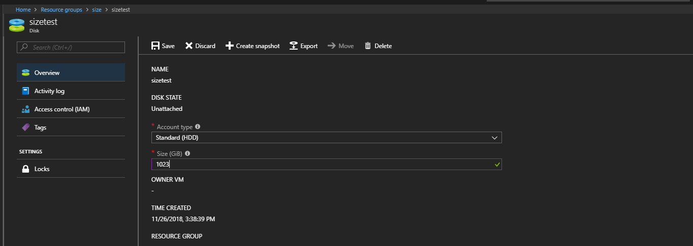

# How to resize virtual machine disks

In this article we will cover the process of resizing disks in the Azure portal. This will be needed if the VM requires more storage space as you can increase current disk capacity rather than adding more disks.

## Steps to changing disk size via portal

1. Power down or detach disk from VM.
  
2. Navigate to the resource group.
3. Select disk.
4. Alter the disk size (Note the max size for a disk is 1023gb for a single disk).
  
5. Save changes.
6. Power back on the VM or reattach the disk.
  

These steps will work for both non managed and managed VM's.

## Feedback

  If you find an issue with this article, click **Improve this Doc** to suggest a change. If you have an idea for how we could improve any of our services, visit [*UKCloud Ideas*](https://ideas.ukcloud.com). Alternatively, you can contact us at <products@ukcloud.com>.
